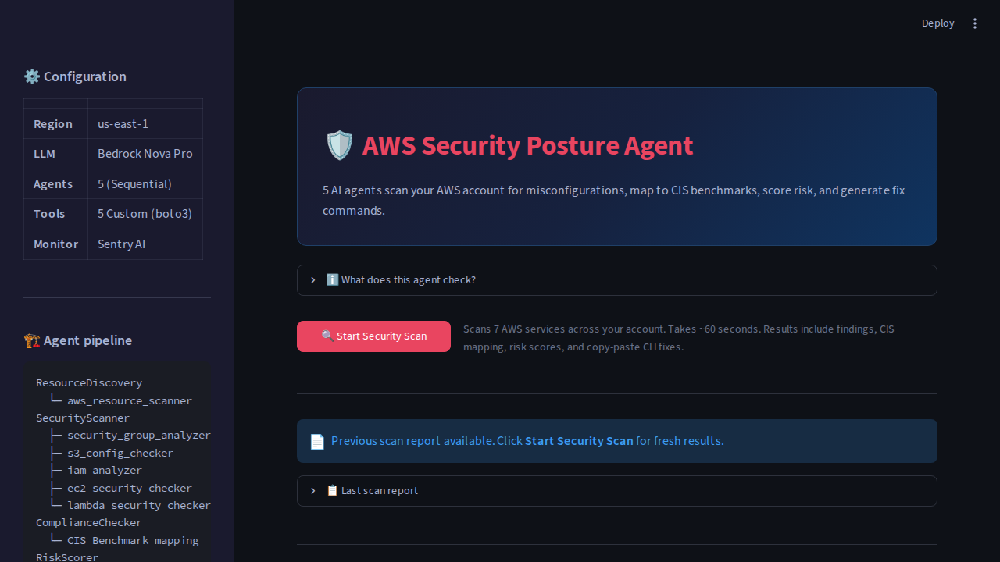
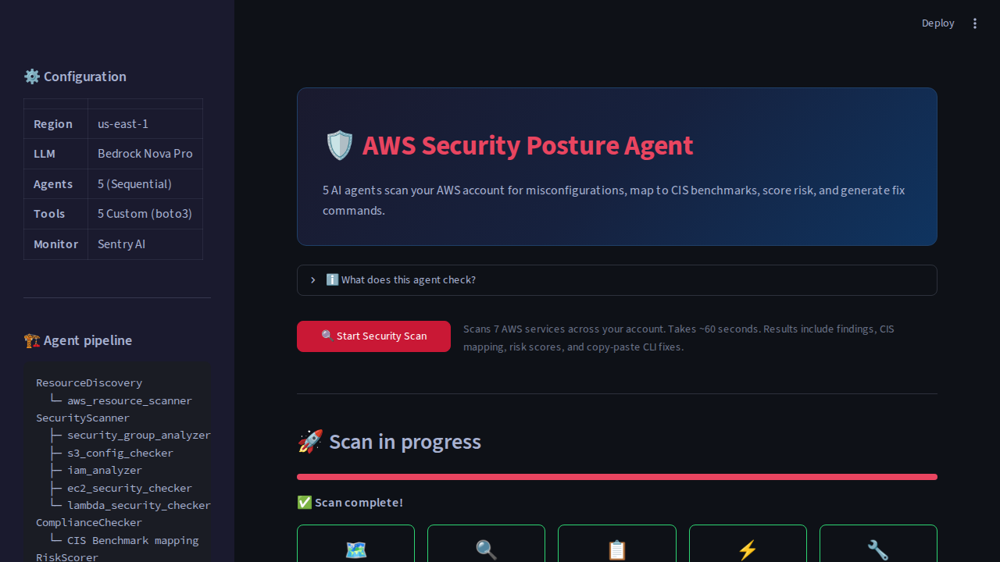
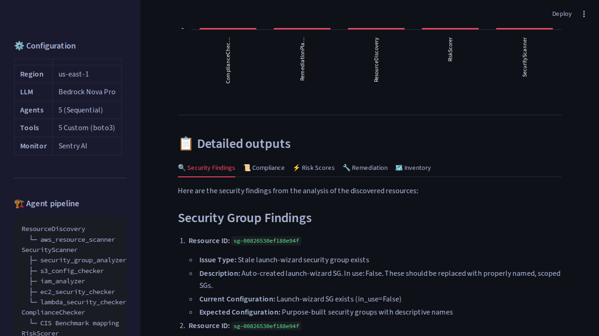
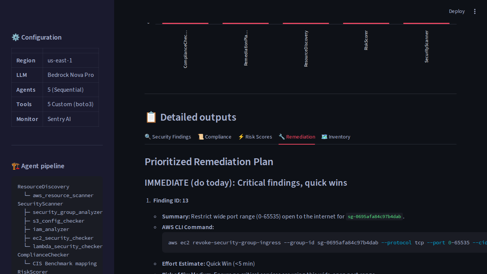
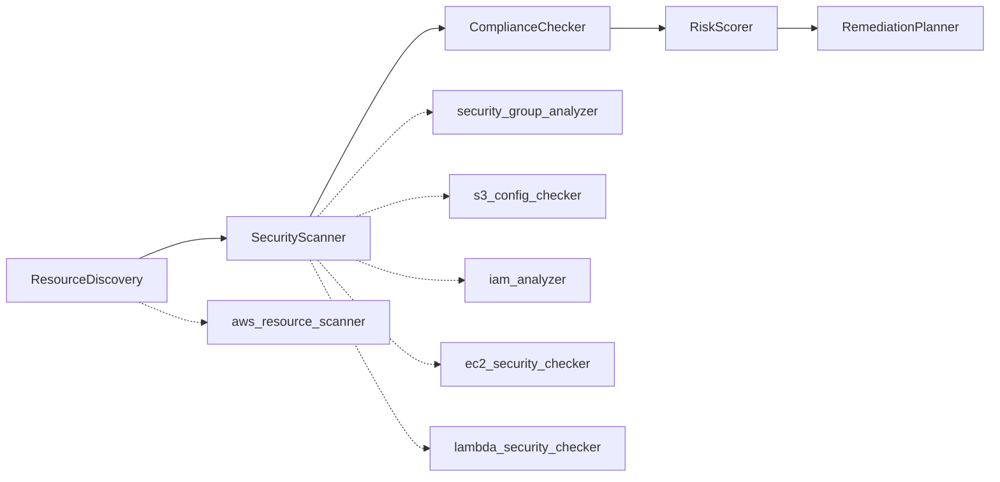

<div align="center">

# AWS Security Posture Agent

**Five AI agents scan your AWS account. Find misconfigurations. Score risk. Get fix commands.**

[](https://python.org)
[](https://crewai.com)
[](https://sentry.io)
[](https://aws.amazon.com/bedrock/)
[](LICENSE)

[Quick Start](#quick-start) | [Architecture](#architecture) | [Screenshots](#screenshots) | [Performance Fix](#performance-bug-fix)

</div>

---

## The Problem

Most AWS accounts accumulate security debt silently. Open SSH ports from testing. S3 buckets without encryption. IAM roles with full admin access that nobody remembers creating. Manual audits miss things. AWS Config rules cost money. SecurityHub is noisy.

This agent scans your account in 60 seconds, finds real issues, maps them to CIS benchmarks, scores risk, and gives you the exact AWS CLI command to fix each one.

## What It Finds

On a real AWS account (90 IAM roles, 14 S3 buckets, 9 security groups, 7 Lambda functions):

```
97 security findings
├── CRITICAL: open SSH/RDP from 0.0.0.0/0, IAM users without MFA
├── HIGH:     admin roles, unencrypted EBS, missing public access blocks  
├── MEDIUM:   deprecated Lambda runtimes, missing versioning, stale SGs
└── LOW:      direct user policies, missing DLQ on Lambda
```

Posture score: **20/100** (before remediation)

---

## Screenshots



<details>
<summary><b>View more screenshots</b> (results, agent times, findings, remediation)</summary>

### Scan Results


### Agent Execution Times


### Security Findings


### Remediation Plan


</details>

---

## Architecture



Each agent runs sequentially. Each tool makes real boto3 API calls. The full pipeline completes in ~60 seconds.

### Sentry Trace Waterfall

```
Transaction: "Security Posture Scan" (57s)
├── gen_ai.invoke_agent: ResourceDiscovery      17s
│   └── gen_ai.execute_tool: aws_resource_scanner
├── gen_ai.invoke_agent: SecurityScanner        18s  ← bottleneck (fixed)
│   ├── gen_ai.execute_tool: security_group_analyzer
│   ├── gen_ai.execute_tool: s3_config_checker
│   ├── gen_ai.execute_tool: iam_analyzer
│   ├── gen_ai.execute_tool: ec2_security_checker
│   └── gen_ai.execute_tool: lambda_security_checker
├── gen_ai.invoke_agent: ComplianceChecker       6s
├── gen_ai.invoke_agent: RiskScorer              4s
└── gen_ai.invoke_agent: RemediationPlanner     10s
```

---

## 5 Agents, 6 Tools

| # | Agent | What It Does | Tools |
|---|-------|--------------|-------|
| 1 | **ResourceDiscovery** | Inventories EC2, S3, Lambda, IAM, SGs, API GW, DynamoDB | `aws_resource_scanner` |
| 2 | **SecurityScanner** | Checks every resource against security baseline | `security_group_analyzer` `s3_config_checker` `iam_analyzer` `ec2_security_checker` `lambda_security_checker` |
| 3 | **ComplianceChecker** | Maps findings to CIS AWS Foundations Benchmark | Analysis only |
| 4 | **RiskScorer** | Scores: severity x blast radius x exploitability | Analysis only |
| 5 | **RemediationPlanner** | Generates prioritized AWS CLI fix commands | Analysis only |

### Security Checks

| Category | What Gets Flagged |
|----------|-------------------|
| **Security Groups** | 0.0.0.0/0 on SSH/RDP/DB ports, wide port ranges, default SG with rules, stale launch-wizard groups |
| **S3 Buckets** | No default encryption, versioning disabled, public access blocks missing |
| **IAM Roles** | AdministratorAccess, PowerUserAccess, wildcard `*` permissions |
| **IAM Users** | No MFA, access keys older than 90 days, direct policy attachments |
| **EC2 Instances** | No IAM instance profile, unencrypted EBS volumes, unnecessary public IPs |
| **Lambda Functions** | Deprecated runtimes, overly permissive execution roles, no dead letter queue |

---

## Quick Start

```bash
# Clone and setup
git clone https://github.com/simplynadaf/aws-security-posture-agent.git
cd aws-security-posture-agent
python -m venv .venv && source .venv/bin/activate
pip install -e .

# Configure
cp .env.example .env
# Edit .env: add SENTRY_DSN, configure AWS credentials (~/.aws/credentials)

# Run (CLI)
python -m security_posture.main

# Run (Web UI)
streamlit run streamlit_app.py
```

### Required AWS Permissions

Read-only access to: EC2, S3, IAM, Lambda, API Gateway, DynamoDB, Security Groups.
No write permissions. The agent only reads and reports.

### Environment Variables

```bash
SENTRY_DSN=https://your-dsn@sentry.io/project   # Optional: enables tracing
AWS_DEFAULT_REGION=us-east-1
MODEL=bedrock/amazon.nova-pro-v1:0
```

---

## Performance Bug Fix

The `IAMAnalyzer` tool had a performance bug: it fetched all 90 roles, produced 27KB of JSON, and overwhelmed the LLM context window. Sentry's trace waterfall made the bottleneck visible.

**[PR #1: Fix IAM pagination + token budget guard](https://github.com/simplynadaf/aws-security-posture-agent/pull/1)**

| Metric | Before | After | Change |
|--------|--------|-------|--------|
| IAM tool output | 26,980 chars | 15,532 chars | **42% smaller** |
| SecurityScanner time | 22.6s | 17.8s | **21% faster** |
| IAM API calls | 59 | 20 | **66% fewer** |
| Total pipeline | 62.0s | 57.7s | **7% faster** |

The fix: paginate to top 20 roles by last-used date, skip service-linked roles, add a 4000-char token budget guard.

---

## Sentry AI Agent Monitoring

Every run creates a Sentry transaction with full observability:

- `gen_ai.invoke_agent` spans for all 5 agents
- `gen_ai.execute_tool` spans for all 6 tool executions
- Token usage per agent
- Output size and duration metrics
- Exception capture with stack traces
- Task completion breadcrumbs

This is how the performance bug was discovered. Standard logging shows "agent finished." Sentry shows which tool inside which agent returned a 27KB payload that triggered a retry.

---

## Tech Stack

| | |
|---|---|
| **Agent Framework** | CrewAI 1.15 |
| **LLM** | Amazon Bedrock Nova Pro v1 |
| **Observability** | Sentry SDK 2.65 (AI Agent Monitoring) |
| **Cloud SDK** | boto3 |
| **UI** | Streamlit |
| **Language** | Python 3.12 |

---

## Project Structure

```
src/security_posture/
├── main.py              # Entry point, Sentry transaction, agent span orchestration
├── crew.py              # CrewAI crew: 5 agents, 5 tasks, sequential process
├── monitoring.py        # init_sentry(), @trace_tool decorator, agent_span()
├── config/
│   ├── agents.yaml      # Agent roles, goals, backstories
│   └── tasks.yaml       # Task descriptions, expected outputs
└── tools/
    ├── aws_resource_scanner.py      # EC2, S3, Lambda, IAM, SGs, API GW, DynamoDB
    ├── security_group_analyzer.py   # Port rules, default SGs, launch-wizard
    ├── s3_config_checker.py         # Encryption, versioning, public access
    ├── iam_analyzer.py              # Roles, policies, MFA, key age (paginated)
    ├── ec2_security_checker.py      # Instance profiles, EBS encryption
    └── lambda_security_checker.py   # Runtimes, roles, DLQ config
```

---

## Built For

This project was built for [DEV's Summer Bug Smash 2026](https://dev.to/bugsmash) challenge, targeting the **Best Use of Sentry** prize category. The performance bug was real, discovered via Sentry's AI Agent Monitoring, and fixed with a measurable improvement.

---

## Author

<table>
<tr>
<td>

**Sarvar Nadaf**

Cloud Architect | 10+ years in Cloud and IT | 7x AWS Certified | AWS Community Builder

[](https://sarvarnadaf.com)
[](https://www.linkedin.com/in/sarvar04/)
[](https://dev.to/sarvar_04)

</td>
</tr>
</table>

---

## License

MIT
