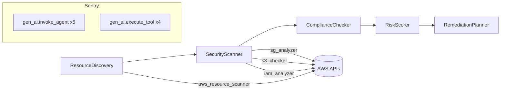

# Project Improvements - TODO (Day 6)

Work on these to maximize Sentry prize score and overall quality.

---

## HIGH IMPACT (Judge will notice these)

### 1. Add Structured Logging with Sentry Logs
**Why:** Submission template asks about "Logs" as a Sentry feature. We claim to use it but don't.
**What to do:**
- Add Python `logging` module with structured log messages in each agent/tool
- Configure `sentry_sdk` to capture logs (LoggingIntegration)
- Log key events: agent start/end, tool invocation, findings count, errors
- Show logs correlated with traces in Sentry dashboard
**Files:** monitoring.py, main.py, each tool
**Effort:** 30 min

### 2. Add Error Simulation + Sentry Error Monitoring
**Why:** Submission template asks about "Error Monitoring." Currently we only capture exceptions if pipeline crashes. Judge wants to see intentional error handling.
**What to do:**
- Add a try/except in IAMAnalyzer that catches boto3 throttling (TooManyRequestsException)
- When a tool fails, capture the error with sentry_sdk.capture_exception() AND continue gracefully
- Add a --simulate-error CLI flag that triggers a controlled failure for demo purposes
- Show the error appearing in Sentry Issues view with full context
**Files:** iam_analyzer.py, main.py
**Effort:** 20 min

### 3. Token Usage Tracking Per Agent (Proper Attribution)
**Why:** The judge from Sentry DX team will look for token cost attribution across agents. This is the "AI observability" differentiator.
**What to do:**
- After each task execution, extract token usage from CrewAI's task output
- Set gen_ai.usage.input_tokens, output_tokens, total_tokens on each agent span
- Calculate cost estimate per agent (Nova Pro pricing: input $0.0008/1K, output $0.0032/1K)
- Show token breakdown in Streamlit UI and in Sentry span data
- Print token summary at end of pipeline run
**Files:** main.py, streamlit_app.py
**Effort:** 45 min

### 4. Create a `before-fix` Branch + PR on GitHub
**Why:** The submission needs a PR link. A clean diff showing the bug vs fix is much more compelling than "look at my commit message."
**What to do:**
- Create branch `before-fix` from initial commit (94cc0b8)
- Put the OLD iam_analyzer.py (with max_roles=100, no pagination) on that branch
- Push branch
- Create PR from `main` into `before-fix` (or vice versa) showing the diff
- PR title: "fix: paginate IAM role analysis to prevent context overflow"
- PR description: metrics table, before/after, root cause explanation
**Commands:**
```bash
git checkout 94cc0b8
git checkout -b before-fix
# Revert iam_analyzer.py to the buggy version
git push origin before-fix
# Create PR via GitHub web UI or gh CLI
```
**Effort:** 15 min

---

## MEDIUM IMPACT (Makes submission look polished)

### 5. Posture Score Gauge in Streamlit UI
**Why:** Visual impact. A big "62/100 MODERATE" score makes the tool feel like a real product, not a demo.
**What to do:**
- Parse RiskScorer output for the overall posture score
- Display as a large metric or progress bar with color coding:
  - 0-40: RED (Critical)
  - 41-60: ORANGE (High Risk)
  - 61-80: YELLOW (Moderate)
  - 81-100: GREEN (Good)
- Add it prominently at the top of results
**Files:** streamlit_app.py
**Effort:** 20 min

### 6. Better Report Output (Clean Markdown)
**Why:** The download button currently gives raw LLM output. A structured report looks more professional.
**What to do:**
- After pipeline completes, generate a clean report with:
  - Header: date, region, account summary
  - Findings table: severity, resource, issue, fix command
  - Posture score section
  - Executive summary (1 paragraph)
- Save as security_report.md
- Offer both markdown and JSON download in Streamlit
**Files:** main.py or new report_generator.py
**Effort:** 30 min

### 7. CLI Flags (--verbose, --quick, --region)
**Why:** Shows the tool is production-ready, not just a demo.
**What to do:**
- Add argparse or click to main.py
- Flags:
  - `--region us-west-2` (scan different region)
  - `--quick` (skip ComplianceChecker and RiskScorer, just scan + remediate)
  - `--verbose` / `--quiet` (control output verbosity)
  - `--max-roles 50` (override IAM pagination limit)
  - `--output report.md` (custom output file)
- Keep backward compatible: no flags = current behavior
**Files:** main.py
**Effort:** 20 min

---

## NICE TO HAVE (Professionalism signals)

### 8. GitHub Actions CI
**Why:** Shows the repo is maintained properly. Badge in README.
**What to do:**
- Create .github/workflows/ci.yml
- Steps: checkout, setup python, install deps, run linter (ruff), run tests
- Add badge to README: 
**Files:** .github/workflows/ci.yml, README.md
**Effort:** 15 min

### 9. Unit Tests for Tools (Mock boto3)
**Why:** Shows code quality. Also useful for CI.
**What to do:**
- Create tests/test_tools.py
- Use unittest.mock to patch boto3 clients
- Test each tool with known mock responses
- Verify findings are generated correctly
- Test the token budget guard in IAMAnalyzer
- Test edge cases: empty account, 0 roles, 0 buckets
**Files:** tests/test_tools.py
**Effort:** 45 min

### 10. Architecture Diagram in README
**Why:** Visual appeal. The README currently has text-based architecture. A proper diagram stands out.
**What to do:**
- Add a Mermaid diagram showing the pipeline flow
- Or create a PNG diagram (draw.io/excalidraw) and add to docs/
- Show: agents, tools, data flow, Sentry spans
- Update README to embed the diagram
**Example mermaid:**

**Files:** README.md, docs/architecture.md or docs/architecture.png
**Effort:** 15 min

---

## Priority Order for Tomorrow

1. **#4** Create before-fix branch + PR (15 min) - needed for submission
2. **#1** Structured logging with Sentry (30 min) - fills a gap in Sentry features
3. **#3** Token usage tracking (45 min) - major differentiator
4. **#2** Error simulation (20 min) - fills another Sentry feature gap
5. **#5** Posture score gauge (20 min) - visual impact
6. **#10** Architecture diagram (15 min) - README appeal
7. **#7** CLI flags (20 min) - production-readiness
8. **#6** Better report output (30 min) - polish
9. **#8** GitHub Actions CI (15 min) - professionalism
10. **#9** Unit tests (45 min) - code quality

**Total estimated time: ~4.5 hours**

After these improvements, the submission will demonstrate ALL Sentry features the template asks about:
- [x] Error Monitoring (improvement #2)
- [x] Logs (improvement #1)
- [x] Distributed Tracing (already done)
- [x] Agent Tracing (already done)
- [x] Token cost attribution (improvement #3)
- [x] Seer RCA (depends on Sentry trial, screenshot from dashboard)

---

## After Improvements, Update Article

Once improvements are done, update submission-1-clear-the-lineup.md:
- Add logging section to "Best Use of Sentry"
- Add error monitoring section
- Add token attribution section
- Update PR link to proper GitHub PR
- Add new screenshots showing logs + errors in Sentry
